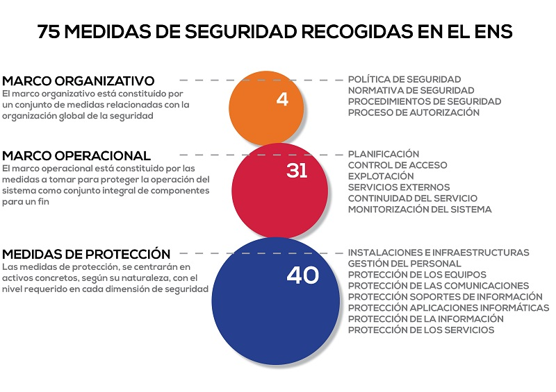
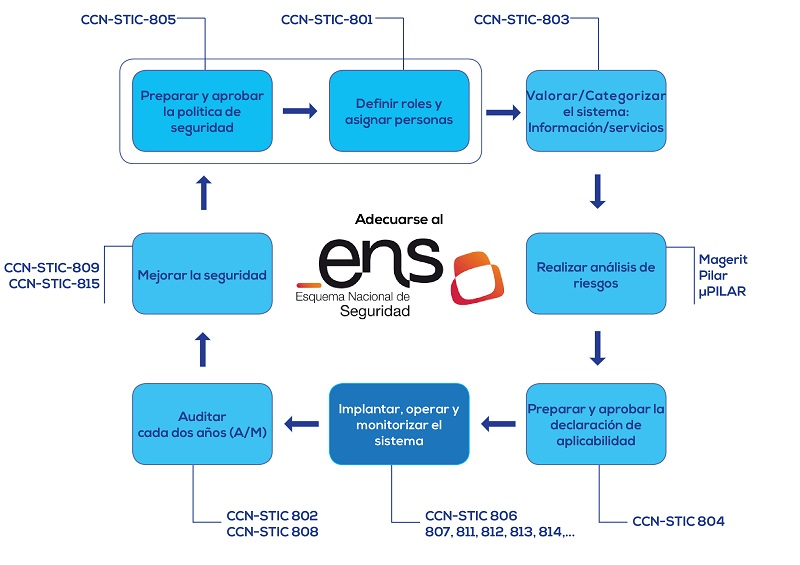
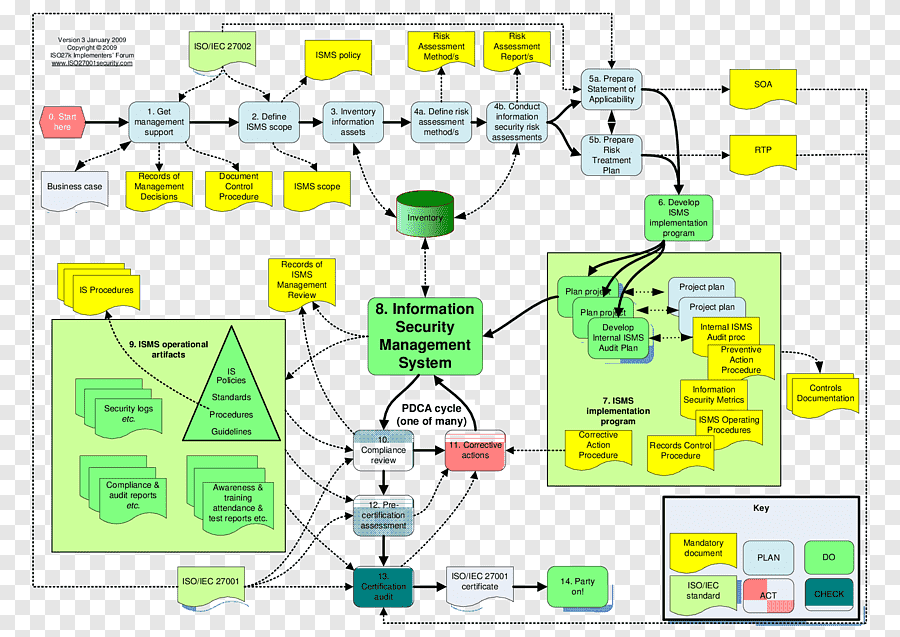
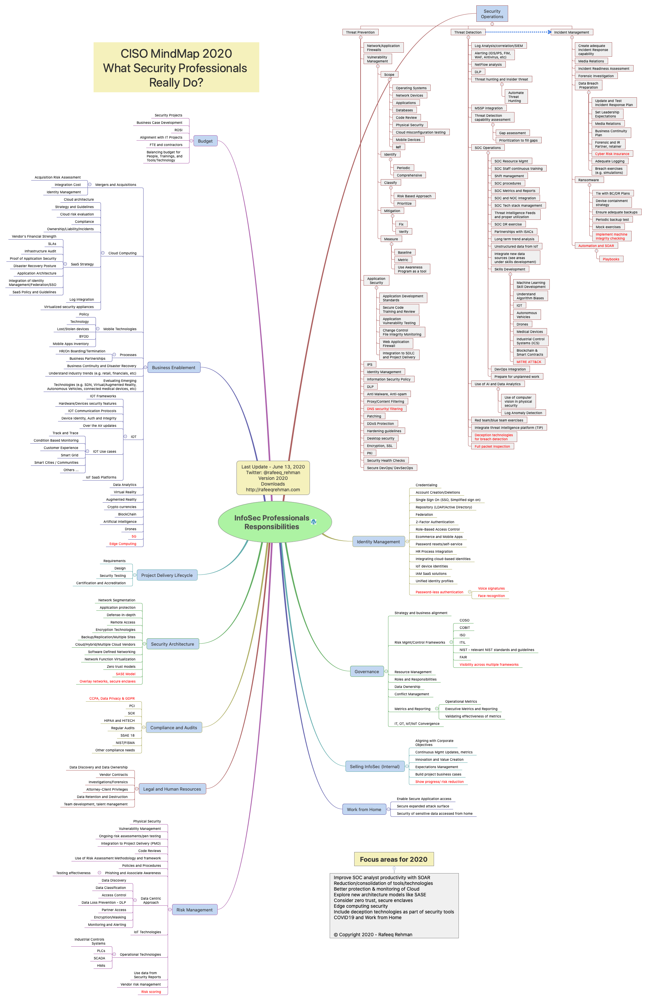

# Gestión de la Seguridad de la Información

[[TOC]]

## Esquema Nacional de Seguridad (para organizaciones públicas en España)
El [Real Decreto 3/2010](https://www.boe.es/buscar/act.php?id=BOE-A-2010-1330), de 8 de enero, por el que se regula el Esquema Nacional de Seguridad en el ámbito de la Administración Electrónica da cumplimiento a lo previsto en el artículo 42 de la Ley 11/2007, de 22 de junio, de acceso electrónico de los ciudadanos a los Servicios Públicos. Su objeto es establecer la política de seguridad en la utilización de medios electrónicos y está constituido por principios básicos y requisitos mínimos que permitan una protección adecuada de la información.
Por tanto, la finalidad del Esquema Nacional de Seguridad es la creación de las condiciones necesarias de confianza en el uso de los medios electrónicos, a través de medidas para garantizar la seguridad de los sistemas, los datos, las comunicaciones y los servicios electrónicos, que permita a los ciudadanos y a las Administraciones públicas, el ejercicio de derechos y el cumplimiento de deberes a través de estos medios.

[Detalle de los 75 controles](https://www.ccn-cert.cni.es/publico/ens/ens/index.html#!1073)

La adecuación ordenada al Esquema Nacional de Seguridad requiere el tratamiento de diversas cuestiones:

- Preparar y aprobar la política de seguridad, incluyendo la definición de roles y la asignación de responsabilidades. (Véase [CCN-STIC 805 Política de seguridad de la información](https://www.ccn-cert.cni.es/publico/seriesCCN-STIC/series/800-Esquema_Nacional_de_Seguridad/805-Politica_de_seguridad_del_ENS/805-ENS_politica-sep11.pdf))
- Categorizar los sistemas atendiendo a la valoración de la información manejada y de los servicios prestados.(Véase [CCN-STIC 803 - Valoración de sistemas en el Esquema Nacional de Seguridad](https://www.ccn-cert.cni.es/publico/seriesCCN-STIC/series/800-Esquema_Nacional_de_Seguridad/803-Valoracion_en_el_ENS/803_ENS-valoracion_ene-11.pdf))
- Realizar el análisis de riesgos, incluyendo la valoración de las medidas de seguridad existentes. (Véase [Magerit versión 3](http://administracionelectronica.gob.es/ctt/magerit) y [programas de apoyo –Pilar-](https://www.ccn-cert.cni.es/ens/instrumentos-para-la-adecuacion.html) )
- Preparar y aprobar la Declaración de aplicabilidad de las medidas del Anexo II del ENS. (Véase [CCN-STIC 804 Medidas e implantación del Esquema Nacional de Seguridad](https://www.ccn-cert.cni.es/publico/seriesCCN-STIC/series/800-Esquema_Nacional_de_Seguridad/804-Medidas_de_implantacion_del_ENS/804_medidas_de_implantacion_del_ens.pdf))
- Elaborar un plan de adecuación para la mejora de la seguridad, sobre la base de las insuficiencias detectadas, incluyendo plazos estimados de ejecución. (Véase [CCN-STIC 806 Plan de adecuación del Esquema Nacional de Seguridad](https://www.ccn-cert.cni.es/publico/seriesCCN-STIC/series/800-Esquema_Nacional_de_Seguridad/806-Plan_adecuacion_ENS/806_ENS-adecuacion_ene-11.pdf))
Implantar operar y monitorizar las medidas de seguridad a través de la gestión continuada de la seguridad correspondiente. (Véase serie [CCN-STIC](https://www.ccn-cert.cni.es/index.php?option=com_content&view=article&id=3639&Itemid=246&lang=es))
- Auditar la seguridad (Véase [CCN-STIC 802 Auditoría del Esquema Nacional de Seguridad](https://www.ccn-cert.cni.es/publico/seriesCCN-STIC/series/800-Esquema_Nacional_de_Seguridad/802-Auditoria_ENS/802-Auditoria_ENS-jun10.pdf) y [CCN-STIC 808 Verificación del cumplimiento de las medidas en el Esquema Nacional de Seguridad](https://www.ccn-cert.cni.es/publico/seriesCCN-STIC/series/800-Esquema_Nacional_de_Seguridad/808/808-Verificacion_del_cumplimiento_medidas_ENS-sep11.pdf))
- Informar sobre el estado de la seguridad (Véase [CCN-STIC 815 Métricas e Indicadores en el Esquema Nacional de Seguridad](https://www.ccn-cert.cni.es/publico/seriesCCN-STIC/series/800-Esquema_Nacional_de_Seguridad/815-Metricas_e_Indicadores_en_el_ENS/815_Metricas_e_indicadores_en_el_ENS-feb14.pdf) y [CCN-STIC 824 Informe del Estado de Seguridad](https://www.ccn-cert.cni.es/series-ccn-stic/800-guia-esquema-nacional-de-seguridad/542-ccn-stic-824-informaci%C3%B3n-del-estado-de-seguridad/file.html))

[Preguntas habituales sobre el ENS](https://www.ccn-cert.cni.es/publico/dmpublidocuments/ENS-FAQ.pdf)

### Política de Seguridad de la Información (PSI)

La seguridad deberá comprometer a todos los miembros de la organización. La **política de seguridad (PSI)** deberá identificar unos claros responsables de velar por su cumplimiento y ser conocida por todos los miembros de la organización administrativa.

[Guía CCN-STIC sobre Políticas de Seguridad](https://www.ccn-cert.cni.es/series-ccn-stic/800-guia-esquema-nacional-de-seguridad/508-ccn-stic-805-politica-de-seguridad-de-la-informacion/file.html)

Se pueden consultar las Políticas de Seguridad de la información en el listado del 
[PAe](https://administracionelectronica.gob.es/pae_Home/pae_Estrategias/pae_Seguridad_Inicio/Politicas_de_seguridad.html#.Xzf0KTXtb-g) 

PSIs de **ministerios**:

- [Ministerio de Agricultura, Alimentación y Medio Ambiente](http://www.boe.es/boe/dias/2015/05/29/pdfs/BOE-A-2015-5937.pdf)
- [Ministerio de Asuntos Exteriores y de Cooperación](http://www.boe.es/buscar/doc.php?id=BOE-A-2013-9544)
- [Ministerio de Cultura y Deporte](https://www.boe.es/eli/es/o/2019/12/27/cud1313)
- [Ministerio de Defensa](http://www.belt.es/legislacion/vigente/Seg_inf/Seg_inf/estatal/290506_OM_Seg_Informacion.pdf)
- [Ministerio de Empleo y Seguridad Social](http://sede.sepe.gob.es/es/portaltrabaja/resources/sede/pdf/OM_politica_seguridad.pdf)
- [Ministerio de Fomento](http://www.boe.es/buscar/doc.php?id=BOE-A-2014-11118)
- [Ministerio de Hacienda y Administraciones Públicas](http://www.boe.es/boe/dias/2014/10/27/pdfs/BOE-A-2014-10965.pdf)
- [Ministerio de Industria, Turismo y Comercio](http://www.boe.es/diario_boe/txt.php?id=BOE-A-2014-10732)
- [Ministerio de Interior](https://www.boe.es/buscar/doc.php?id=BOE-A-2019-5536)
- [Ministerio de Justicia](https://www.boe.es/boe/dias/2017/12/28/pdfs/BOE-A-2017-15662.pdf)
- [Ministerio de Política Territorial y Administración Pública](http://www.boe.es/diario_boe/txt.php?id=BOE-A-2011-18187)
- [Ministerio de Presidencia](http://sedempr.gob.es/es/content/normativa-reguladora)
- [Ministerio de Sanidad, Servicios Sociales e Igualdad](http://www.boe.es/buscar/doc.php?id=BOE-A-2014-2378)

PSIs de **organismos públicos** de la AGE:

- [AEAT](http://www.boe.es/buscar/act.php?id=BOE-A-2012-14621) (Agencia Estatal de Administración Tributaria)
- [Comisión Nacional de los Mercados y la Competencia](https://www.cnmc.es/sites/default/files/2018-06-18_Resolucion_Pol%C3%ADtica_de_Seguridad_de_la_Informaci%C3%B3n.pdf) (CNMC)
- [IGAE](http://boe.es/diario_boe/txt.php?id=BOE-A-2016-165) - Secretaría de Estado de Presupuestos y Gastos y de la Intervención General de la Administración del Estado
- [Red.es](https://www.red.es/redes/sites/redes/files/Poli%CC%81tica%20de%20Seguridad.pdf)
- [Seguridad Social](https://sede.seg-social.gob.es/wps/portal/sede/sede/Inicio/NormativayLegislacion)

PSIs de **Comunidades Autónomas** y sus organismos:

- Aragón:
  [Departamento de Agricultura, Ganadería y Medio Ambiente](https://www.aragon.es/-/politica-de-seguridad-de-la-informacion-del-departamento-de-agricultura-ganaderia-y-medio-ambiente), 
  [Instituto de Investigación Sanitaria](https://www.iisaragon.es/wp-content/uploads/2019/09/POLPoliticaSeguridadInformacion1A.pdf)
- Madrid: [Consejería de Sanidad](http://www.madrid.org/wleg_pub/secure/normativas/contenidoNormativa.jsf?opcion=VerHtml&idnorma=9364&word=S&wordperfect=N&pdf=S#no-back-button)
- Andalucía: [Junta de Andalucía](http://www.juntadeandalucia.es/boja/2011/11/2).[Modificación de 2017](http://www.juntadeandalucia.es/boja/2017/110/BOJA17-110-00009-10321-01_00115562.pdf)
- La Rioja: [Comunidad Autónoma de La Rioja](http://ias1.larioja.org/boletin/Bor_Boletin_visor_Servlet?referencia=1755989-1-PDF-483969)

PSIs de **entidades locales**:

- [Junta General del Principado de Asturias](http://anleo.jgpa.es:8080/documentos/Boletines/PDF/10C-029.pdf)
- [Ayuntamiento de Málaga](http://www.malaga.eu/export/sites/default/ayto/portadaAyto/portal/menu/portada/documentos/Politica_de_Seguridad_de_la_Informacion_Ayuntamiento_de_Malaga.pdf) 

### Responsabilidades y funciones

- [CCN-STIC-801](https://www.ccn-cert.cni.es/series-ccn-stic/800-guia-esquema-nacional-de-seguridad/501-ccn-stic-801-responsibilidades-y-funciones-en-el-ens/file.html) Responsabilidades y Funciones

### Inventario de activos
El inventario de activos conforma el primer elemento de la cadena en un sistema de gestión de la seguridad de un sistema. Un inventario de activos se define como una lista de todos aquellos recursos (físicos, software, documentos, servicios, personas, instalaciones, etc.) que tengan valor para la organización y necesiten por tanto ser protegidos de potenciales riesgos.
Dicho de otra manera, si no sabes qué tienes que proteger ¿cómo vas a protegerlo?

[Inventario de activos según INCIBE](https://www.incibe-cert.es/blog/inventario-activos-y-gestion-seguridad-sci)

¿Qué herramientas te pueden ayudar con el inventario de activos?
- Identity and systems management tools
- Endpoint security management software
- Vulnerability scanning tools
- Passive and active network monitoring solutions
- Cloud orchestration technologies

<!--

- [ServiceNow IT Service Management](https://www.servicenow.com/products/itsm.html)
- [BMC Helix CMDB](https://www.bmcsoftware.es/it-solutions/bmc-helix-cmdb.html)
- [BMC Helix Discovery](https://www.bmcsoftware.es/it-solutions/bmc-helix-discovery.html)
- [EasyVista](https://www.easyvista.com/es/solucion/gestion-activos-ti)
- [MicroFocus](https://www.microfocus.com/es-es/products/configuration-management-system-database/overview)
-->

### Categorización de los sistemas

[CCN-STIC-803](https://www.ccn-cert.cni.es/series-ccn-stic/800-guia-esquema-nacional-de-seguridad/682-ccn-stic-803-valoracion-de-sistemas-en-el-ens-1/file.html) ENS. Valoración de los sistemas

### Declaración de aplicabilidad

La  Declaración  de  Aplicabilidad,  en  el  ámbito  del [ENS](https://www.boe.es/buscar/act.php?id=BOE-A-2010-1330), es  el  documento en  el  que  se **formaliza la relación de medidas de seguridad** que resultan de aplicación al sistema de información  de  que  se  trate, conforme  a  su  categoría,  y  que  se  encuentran  recogidas en el
[Anexo II del RD 3/2010](https://www.boe.es/buscar/act.php?id=BOE-A-2010-1330#anii), que lo regula.

Las  medidas  de  seguridad  referenciadas  en  el  Anexo  II  **podrán  ser  reemplazadas  por
otras medidas compensatorias** siempre  y  cuando  se  justifique  documentalmente  que protegen igual o mejor el riesgo sobre los activos ([Anexo I](https://www.boe.es/buscar/act.php?id=BOE-A-2010-1330#ani))
y se satisfacen los principios básicos  y  los  requisitos  mínimos  previstos en  los  capítulos  II  y  III  del  Real  Decreto 3/2010.

Como parte integral de la Declaración de Aplicabilidad, se indicará de forma detallada la  correspondencia  entre  las  medidas  compensatorias implementadas y las  medidas del  Anexo  II  que  compensan siendo objeto  de  aprobación  formal  por  parte  del responsable de seguridad.

Referencias:

- 
- [CCN-CERT BP/14](https://www.ccn-cert.cni.es/informes/informes-de-buenas-practicas-bp/3830-ccn-cert-bp-14-declaracion-de-aplicacibilidad-ens/file.html) - 
  Declaración de Aplicabilidad en el ENS(Perfil de Cumplimiento).

### Análisis y gestión de riesgos
   
Cada organización que desarrolle e implante sistemas para el tratamiento de la información y las comunicaciones realizará su propia gestión de riesgos.
   
Esta gestión se realizará por medio del análisis y tratamiento de los riesgos a los que está expuesto el sistema. Las medidas adoptadas para mitigar o
suprimir los riesgos deberán estar justificadas y, en todo caso, existirá una **proporcionalidad** entre ellas y los riesgos.

Referencias:
- [Magerit v3](https://administracionelectronica.gob.es/pae_Home/pae_Documentacion/pae_Metodolog/pae_Magerit.html) Metodología para el análisis y gestión de riesgos.
- [PILAR](https://pilar.ccn-cert.cni.es/) Conjunto de soluciones del CCN para la realización del análisis de riesgos.

### Normativa de seguridad
Guías CCN-STIC:
- [ENS. Normas de seguridad](https://www.ccn-cert.cni.es/series-ccn-stic/800-guia-esquema-nacional-de-seguridad/529-ccn-stic-821-normas-de-seguridad-en-el-ens/file.html)
- [ENS. Apéndice I. NG 00 Utilización de recursos y sistemas](https://www.ccn-cert.cni.es/publico/seriesCCN-STIC/series/800-Esquema_Nacional_de_Seguridad/821-Normas_de_Seguridad_en_el_ENS/821-Normas_de_seguridad-abr13-NG00.pdf)
- [ENS. Apéndice II. NP 10 Normas de acceso a Internet](https://www.ccn-cert.cni.es/series-ccn-stic/800-guia-esquema-nacional-de-seguridad/531-ccn-stic-821-normas-de-seguridad-en-el-ens-anexo-ii/file.html)
- [ENS. Apéndice III. NP 20 Normas de acceso al correo Electrónico (E-Mail)](https://www.ccn-cert.cni.es/publico/seriesCCN-STIC/series/800-Esquema_Nacional_de_Seguridad/821-Normas_de_Seguridad_en_el_ENS/821-Normas_de_seguridad-abr13-NP20.pdf)
- [ENS. Apéndice IV. NP 30 Normas para trabajar fuera de las instalaciones del organismo](https://www.ccn-cert.cni.es/publico/seriesCCN-STIC/series/800-Esquema_Nacional_de_Seguridad/821-Normas_de_Seguridad_en_el_ENS/821-Normas_de_seguridad-abr13-NP30.pdf)
- [ENS. Apéndice V. NP 40 Normas de creación y uso de contraseñas](https://www.ccn-cert.cni.es/series-ccn-stic/800-guia-esquema-nacional-de-seguridad/534-ccn-stic-821-normas-de-seguridad-en-el-ens-anexo-v/file.html)
- [ENS. Apéndice VI. NP 50 Acuerdo de confidencialidad para terceros](https://www.ccn-cert.cni.es/series-ccn-stic/800-guia-esquema-nacional-de-seguridad/535-ccn-stic-821-normas-de-seguridad-en-el-ens-anexo-vi/file.html)
- [ENS. Apéndice VII. NP 60 Modelo de contenido de buenas prácticas para terceros](https://www.ccn-cert.cni.es/series-ccn-stic/800-guia-esquema-nacional-de-seguridad/536-ccn-stic-821-normas-de-seguridad-en-el-ens-anexo-vii/file.html)
- [ENS. Apéndice VIII. NP 70 Normativa de uso de redes sociales](https://www.ccn-cert.cni.es/series-ccn-stic/800-guia-esquema-nacional-de-seguridad/2722-821-ccn-stic-apendice-viii/file.html)

### Gestión de personal
   
Todo el personal relacionado con la información y los sistemas deberá ser formado e informado de sus deberes y obligaciones en materia de seguridad.
Sus actuaciones deben ser supervisadas para verificar que se siguen los procedimientos establecidos.
   
El personal relacionado con la información y los sistemas, ejercitará y aplicará los principios de seguridad en el desempeño de su cometido.
   
El significado y alcance del uso seguro del sistema se concretará y plasmará en unas normas de seguridad.

::: tip
Cada usuario que acceda a la información del sistema debe estar **identificado de forma única**
::: 

### Plan de formación y concienciación
Pendiente de desarrollar
<!--
 [ProofPoint](https://www.proofpoint.com/es/products/security-awareness-training)
 [Firewall Mindset](https://thefirewallmindset.com/?utm_source=web&utm_medium=Entelgy&utm_campaign=TFMSficha)
-->

### Gestión Incidentes de seguridad
Referencias:
- [ENS Gestión de ciberincidentes](https://www.ccn-cert.cni.es/series-ccn-stic/800-guia-esquema-nacional-de-seguridad/988-ccn-stic-817-gestion-de-ciberincidentes/file.html) 
- [GUÍA NACIONAL DE NOTIFICACIÓN Y GESTIÓN DE CIBERINCIDENTES](http://www.interior.gob.es/documents/10180/9771228/Gu%C3%ADa+Nacional+de+Notificaci%C3%B3n+y+Gesti%C3%B3n+de+Ciberincidentes.pdf)

### Adquisición de productos de seguridad y contratación de servicios de seguridad

En la adquisición de productos de seguridad de las TIC que vayan a ser empleados por las AAPP se utilizarán, de forma proporcionada a la categoría del sistema y nivel de seguridad determinados, aquellos que tengan **certificada la funcionalidad de seguridad** relacionada con el objeto de su adquisición, salvo en aquellos casos en que las exigencias de proporcionalidad en cuanto a los riesgos asumidos no lo justifiquen a juicio del responsable de Seguridad.
Ver [Catálogo CCN-STIC](../new_04_tecnologias/readme.md#catalogo-de-productos-de-seguridad-de-las-tecnologias-de-la-informacion-y-la-comunicacion)

### Listado de expedientes de AAPP relacionados con ciberseguridad
- GISS 2023: [Servicios de ciberseguridad](https://contrataciondelestado.es/wps/portal/!ut/p/b0/04_Sj9CPykssy0xPLMnMz0vMAfIjU1JTC3Iy87KtUlJLEnNyUuNzMpMzSxKTgQr0w_Wj9KMyU1zLcvQjfZJKkyojPH19w3IjAsMMwl3NcyIDym1t9Qtycx0BKOGFLQ!!/)
- Andalucia CERT 2023: [Servicios de SOC](https://www.juntadeandalucia.es/haciendayadministracionpublica/apl/pdc_sirec/perfiles-licitaciones/detalle-licitacion.jsf?idExpediente=595121)
- Andalucia CERT 2023: [EDR y servicios asociados](https://www.juntadeandalucia.es/haciendayadministracionpublica/apl/pdc_sirec/perfiles-licitaciones/detalle-licitacion.jsf?idExpediente=455736)
- CCMAD 2023: [Servicios de ciberseguridad](https://contrataciondelestado.es/wps/portal/!ut/p/b0/DcoxCoAwDADAJ4U6Ch1EfICLrVkk2qDBtCrUor_X8eAAwQMmKrJSliOR_h4D86mS9jpwJlWeVBbJtPwBHCCghK4ojL56jRtK30gbr8rczzbT0FsLZ4zNB2vB0rA!/)

### Clausulado de Seguridad en la contratación pública
Pendiente de desarrollar.

Referencias interesantes:
- [Obligaciones de los prestadores de servicios a las entidades
públicas](https://www.ccn.cni.es/index.php/es/docman/documentos-publicos/abstract/257-abstract-obligaciones-de-los-prestadores-de-servicios-a-las-entidades-publicas/file)
- [Guía para la contratación de productos y servicios de seguridad en entornos hospitalarios. ENISA](https://www.enisa.europa.eu/publications/good-practices-for-the-security-of-healthcare-services/at_download/fullReport)

### Auditorías de Cumplimiento

- [CCN-STIC-802](https://www.ccn-cert.cni.es/series-ccn-stic/800-guia-esquema-nacional-de-seguridad/502-ccn-stic-802-auditoria-del-ens/file.html) ENS. Guía de auditoría.
- [CCN-STIC-808](https://www.ccn-cert.cni.es/series-ccn-stic/800-guia-esquema-nacional-de-seguridad/518-ccn-stic-808-verificacion-del-cumplimiento-de-las-medidas-en-el-ens-borrador/file.html) Verificación del cumplimiento del ENS

## ISO 27000
[Serie 27000](https://es.wikipedia.org/wiki/ISO/IEC_27000-series)
[ISO/IEC 27001](https://www.iso.org/isoiec-27001-information-security.html)

- [ISO/IEC 27018:2019 Protección de datos personales en la nube](https://www.iso.org/standard/76559.html)
- [ISO/IEC 27701:2019 Gestión de la información de privacidad](https://www.iso.org/standard/71670.html)
- [ISO/IEC 29184:2020 Aviso de privacidad online y consentimiento](https://www.iso.org/standard/70331.html)
- [ISO/IEC 27102:2019 Gestión de seguridad de la información – Guía para ciberseguros](https://www.iso.org/standard/72436.html)
- [ISO/IEC 19086-4:2019 SLA Cloud computing–Componentes de seguridad y protección de datos personales](https://www.iso.org/standard/68242.html)
- [ISO 22301:2019 Continuidad del negocio](https://www.iso.org/standard/75106.html)

## NIST Cibersecurity Framework
[Framework for Improving Critical Infrastructure Cybersecurity](https://nvlpubs.nist.gov/nistpubs/CSWP/NIST.CSWP.04162018.pdf)
[Presentación](https://www.nist.gov/document/cybersecurityframeworkv1-1presentationpptx)

[NIST SP 800-37 Risk Management Framework Rev 2](https://nvlpubs.nist.gov/nistpubs/SpecialPublications/NIST.SP.800-37r2.pdf)

## CIS (Critical Security Controls)
Extraido de [Center For Internet Security](http://www.cisecurity.org/controls/), con licencia Creative Commons Attribution-Non-Commercial-No Derivatives 4.0 International Public License.

[PDF](/docs/cis-controls-v71.pdf) CIS Security Controls v7.1
[Excel](/docs/cis-controls-v71.xlsx) CIS Security Controls v7.1

### Basics (1-6)
#### 1. Inventario y control de activos de hardware
Administración activa (inventario, seguimiento y corrección) de todos los dispositivos de hardware en la red para que solo los dispositivos autorizados tengan acceso, y aquellos dispositivos que no estén autorizados ni gestionados, sean localizados y se les impide el acceso.

#### 2. Inventario y control de activos de software
Administración activa (inventariar, rastrear y corregir) de todo el software en la red para que solo el software autorizado está instalado y puede ejecutarse, y que todo el software no autorizado y no administrado, sea localizado y se impide su instalación o ejecución.

#### 3. Gestión continua de vulnerabilidades 
Obtener, evaluar y tomar acciones continuamente sobre nueva información para identificar vulnerabilidades, remediar y minimizar la ventana de oportunidad para los atacantes.

#### 4. Uso controlado de privilegios administrativos
Los procesos y herramientas utilizados para rastrear / controlar / prevenir / corregir el uso, asignación y
configuración de privilegios administrativos en equipos, redes y aplicaciones.

#### 5. Configuración segura de hardware y software en dispositivos móviles, equipos portátiles, puestos de trabajo y servidores
Establecer, implementar y administrar activamente (realizar un seguimiento, informar y corregir) la configuración de seguridad
de dispositivos móviles, portátiles, servidores y puestos de trabajo con una configuración rigurosa de gestión y control de cambios, para evitar que los atacantes exploten servicios y entornos vulnerables.

#### 6. Mantenimiento, seguimiento y análisis de registros de auditoría
Recopilar, administrar y analizar los registros de auditoría de eventos que podrían ayudar a detectar, comprender o recuperarse de un ataque.

### Foundational (7-16)

#### 7.Protecciones de correo electrónico y navegador web
Minimizar la superficie de ataque y las oportunidades para que los atacantes manipulen el comportamiento humano, a través de su interacción con navegadores web y sistemas de correo electrónico

#### 8. Defensas contra malware
Controlar la instalación, propagación y ejecución de código malicioso en varios puntos de la organización, mientras se optimiza el uso de la automatización para permitir una actualización rápida de los datos de defensa, recolección y acción correctiva.

#### 9. Limitación y control de puertos de red, Protocolos y servicios
Gestionar (rastrear / controlar / corregir) el uso operativo continuo de puertos, protocolos y servicios.

#### 10. Capacidades de recuperación de datos
Los procesos y herramientas utilizados para respaldar adecuadamente la información crítica con una metodología probada.
para la recuperación oportuna de la misma.

#### 11. Configuración segura para dispositivos de red, como cortafuegos, enrutadores y conmutadores
Establecer, implementar y administrar activamente (rastrear, informar, corregir) la configuración de seguridad de
Dispositivos de infraestructura de red que utilizan una gestión rigurosa de configuración y control de cambios, para evitar que los atacantes exploten servicios y configuraciones vulnerables.

#### 12. Protección perimetral
Detectar / prevenir / corregir el flujo de información que se transfiere a través de redes de diferente nivel de confianza con un enfoque en datos puedan ser dañinos para la seguridad.

#### 13. Protección de Datos
Los procesos y herramientas utilizados para prevenir la filtración de datos, mitigar los efectos de la filtración de datos,
y garantizar la privacidad e integridad de la información confidencial.

#### 14. Acceso controlado basado en la necesidad de saber
Los procesos y herramientas utilizados para rastrear / controlar / prevenir / corregir el acceso seguro a activos críticos
(por ejemplo, información, recursos, sistemas) de acuerdo con la determinación formal de qué personas, que equipos y qué aplicaciones tienen la necesidad y el derecho de acceder a estos activos críticos basado en una clasificación aprobada.

#### 15. Control de acceso inalámbrico 
Los procesos y herramientas utilizados para rastrear / controlar / prevenir / corregir el uso seguro del área local inalámbrica
redes (WLAN), puntos de acceso y sistemas de clientes inalámbricos.

#### 16. Seguimiento y control de cuentas
Administrar activamente el ciclo de vida de las cuentas de aplicaciones y sistemas - su creación, uso, inactividad, eliminación - con el fin de minimizar las oportunidades de que los atacantes los aprovechen.

### Organizational (17-20)
#### 17. Implementar un programa de capacitación y concienciación sobre seguridad
Para todos los roles funcionales en la organización (priorizando aquellos de misión crítica para el negocio y su seguridad), identificar los conocimientos, habilidades y habilidades específicos necesarios para apoyar la defensa de la organización; desarrollar y ejecutar un plan integrado para evaluar, identificar brechas y remediar a través de programas de políticas, planificación organizacional, capacitación y concienciación, en materia de seguridad.

#### 18. Seguridad del software de aplicación
Gestionar el ciclo de vida de seguridad de todo el software desarrollado y adquirido internamente para prevenir, detectar y corregir las debilidades de seguridad.

#### 19. Gestión y respuesta a incidentes
Proteger la información de la organización, así como su reputación, desarrollando e implementando una infraestructura de respuesta a incidentes (por ejemplo, planes, roles definidos, capacitación, comunicaciones, supervisión de la gestión) para descubrir rápidamente un ataque y luego contener eficazmente el daño, erradicar la presencia del atacante y restaurar la integridad de la red y sistemas.

#### 20. Pruebas de penetración y ejercicios de RedTeam
Poner a prueba la solidez general de la defensa de una organización (la tecnología, los procesos y las personas) simulando los objetivos y acciones de un atacante.

### Recursos interesantes sobre CIS (Critital Security Controls)
- [AuditScripts Critical Security Control Executive Assessment Tool](https://www.auditscripts.com/download/2788/)
- [CIS Critical Security Control v7.1 Assessment Tool](https://www.auditscripts.com/download/4229/)
- [AuditScripts Critical Security Controls Master Mapping](https://www.auditscripts.com/download/2742/)
- [2011. A Small Business No Budget Implementation of the SANS 20 Security Controls](https://www.sans.org/reading-room/whitepapers/hsoffice/small-business-budget-implementation-20-security-controls-33744)

## Secure Controls Framework
[https://www.securecontrolsframework.com/](https://www.securecontrolsframework.com/)

## Cuestiones generales sobre organización de la Ciberseguridad
CISO Mind Map by [RAFEEQ REHMAN](https://rafeeqrehman.com/2020/06/12/ciso-mindmap-2020-what-do-infosec-professionals-really-do/)[PDF](http://rafeeqrehman.com/wp-content/uploads/2020/06/CISO_Job_MindMap_Rafeeq_Rehman_v_2020.pdf) 

 

