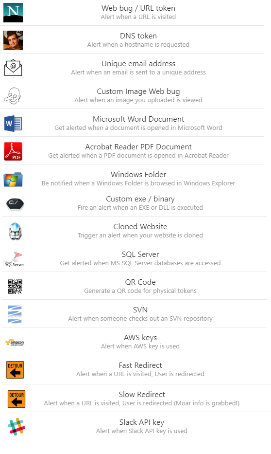

# Detección y Respuesta

[[TOC]]

## Soluciones del CCN para gestion de ciberincidentes
- [SAT-INET](https://www.ccn-cert.cni.es/gestion-de-incidentes/sistema-de-alerta-temprana-sat/sat-inet.html). Sonda del CCN para detectar tráfico malicioso y abrir incidente en LUCIA.
- [SAT-ICS](https://www.ccn-cert.cni.es/gestion-de-incidentes/sistema-de-alerta-temprana-sat/sat-ics.html) Sonda del CCN para detectar tráfico malicioso, especialmente orientado a protocolos industriales.
- [LUCIA](ccn-cert.cni.es/soluciones-seguridad/lucia.html). Gestión del ciclo de vida de los ciberincidentes.
- [CARMEN](https://www.ccn-cert.cni.es/soluciones-seguridad/carmen.html). Detección de APTs.
- [GLORIA](https://www.ccn-cert.cni.es/soluciones-seguridad/gloria.html)- SIEM.
- [MARIA](https://www.ccn-cert.cni.es/soluciones-seguridad/maria-publico.html). Como un virustotal, pero subiendo las muestras al CCN.
- [MARTA](https://www.ccn-cert.cni.es/soluciones-seguridad/marta.html). Sandboxing para ficheros maliciosos, en la nube del CCN.
- [REYES](https://www.ccn-cert.cni.es/soluciones-seguridad/reyes.html). Inteligencia de amenazas. Compartición de IOCs.
- [VANESA](https://vanesa.ccn-cert.cni.es/userportal/#/home/channel/5e89c77de4b02b452626aff2) Sesiones en vídeo sobre cada una de las herramientas.

## Inteligencia de amenazas - IOCs

Lista de recursos:
- [REYES](https://www.ccn-cert.cni.es/soluciones-seguridad/reyes.html). Inteligencia de amenazas. Compartición de IOCs. Solo accesible para organismos públicos.
- [VirusTotal](https://www.virustotal.com/gui/home) Analyze suspicious files and URLs to detect types of malware, automatically share them with the security community
- [YARA](https://yara.readthedocs.io/en/stable/)
- [MISP](https://www.misp-project.org/) Open Source Threat Intelligence Platform
- [Cisco Talos](https://talosintelligence.com/)
- [URLhaus](https://urlhaus.abuse.ch/) Sharing malicious URLs that are being used for malware distribution.
- [Recopilatorio de Threat Inteligence sources](https://github.com/hslatman/awesome-threat-intelligence)

## Gestion Logs - Correlación eventos - SIEM
¿Qué es un SIEM? Es un sistema de seguridad compuesto por múltiples componentes de monitorización y análisis destinados a ayudar a las organizaciones a detectar amenazas y mitigarlas. Un SIEM combina una serie disciplinas y herramientas de seguridad bajo un paraguas integral:
* Gestión de registros (LMS): herramientas utilizadas para la recopilación y el almacenamiento de registros tradicionales.
* Gestión de la información de seguridad (SIM): herramientas o sistemas que se centran en recopilar y gestionar datos relacionados con la seguridad de múltiples fuentes de datos. Estas fuentes de datos pueden ser, por ejemplo, firewalls, servidores DNS, enrutadores, aplicaciones antivirus.
* Gestión de eventos de seguridad (SEM): sistemas que se basan en la supervisión y el análisis proactivos, incluida la visualización de datos, la correlación de eventos y las alertas.

SIEM es el término que se utiliza hoy en día para un sistema de gestión que fusiona todo lo anterior en una sola capa que sabe cómo recopilar y procesar automáticamente información de fuentes distribuidas, almacenarla en una ubicación centralizada, correlacionar entre diferentes eventos y producir alertas e informes basados en esta información.

Componentes de un SIEM:
* Agregación: al representar la salida sin procesar de los procesos en ejecución en un entorno digital, los registros son la fuente perfecta para proporcionar una imagen precisa de lo que está sucediendo en tiempo real.
* Procesamiento y normalización: el mayor desafío en la recopilación de datos en el contexto de SIEM es superar la variedad de formatos de registro. Un sistema SIEM, por su propia naturaleza, extraerá datos de una gran cantidad de capas (servidores, firewalls, enrutadores de red, bases de datos), por nombrar solo algunas, cada una de las cuales registrará un formato diferente.
* Correlación: una vez recopilados, analizados y almacenados, el siguiente paso en los sistemas SIEM es el de conectar los puntos y correlacionar los eventos de las diferentes fuentes de datos. Este trabajo de correlación se basa en reglas proporcionadas por varias herramientas SIEM, predefinidas para diferentes escenarios de ataque, o creadas y ajustadas por el analista.
* Presentación: la capacidad de visualizar datos y eventos es otro componente clave en los sistemas SIEM, ya que permite a los analistas ver datos fácilmente. Los paneles que contienen múltiples visualizaciones o vistas ayudan a identificar tendencias, anomalías y monitorear el estado general o de seguridad de un entorno. Algunas herramientas SIEM vendrán con paneles prefabricados, mientras que otras permitirán a los usuarios crear y ajustar los suyos propios.
* Mitigación y remediación: una vez que se implementan las reglas de correlación y se crean los paneles de control para proporcionar una descripción general completa del sistema, el último componente clave de un sistema SIEM es cómo se manejan los incidentes una vez identificados. La mayoría de los sistemas SIEM admiten mecanismos para contener y mitigar automáticamente los eventos de seguridad. Por ejemplo, según las reglas de correlación, se puede configurar un sistema SIEM para que comience automáticamente un proceso de escalamiento interno: ejecutar scripts que inician el proceso de contención y pasar el balón al recurso correcto en la organización activando una alerta, abriendo un ticket, etc.

- [SIGMA Rules](https://github.com/Neo23x0/sigma). Lenguaje para describir reglas de correlación.

Recursos interesantes:
- [El SOC de la AGE](https://www.ccn.cni.es/index.php/es/ccn-cert-menu-es/soc-age/soc-age-faq) Preguntas y respuestas.
- [2020. 8 WAYS TO DETECT MALICIOUS FIREWALL TRAFFIC USING SIEM](https://blueteamblog.com/8-ways-to-detect-malicious-firewall-traffic-using-siem)
- [2019- A Blue Team guide to Azure & Office 365 monitoring](https://0x00sec.org/t/a-blue-team-guide-to-azure-office-365-monitoring/14411)
- [2020. 18 WAYS TO DETECT MALCIOUS ACTIONS IN YOUR ACTIVE DIRECTORY LOGS USING SIEM](https://blueteamblog.com/18-ways-to-detect-malcious-actions-in-your-active-directory-logs-using-siem)

## Centros de Operaciones de Seguridad (SOCs)
- [2020. Expel. Performance metrics, part 1: Measuring SOC efficiency](https://expel.io/blog/performance-metrics-measuring-soc-efficiency/)
- [2019. Introducing the Funnel of Fidelity](https://posts.specterops.io/introducing-the-funnel-of-fidelity-b1bb59b04036)
 
- [2019. 7 habits of highly effective SOCs](https://expel.io/blog/7-habits-highly-effective-socs/)
- [2020. Expel. Behind the scenes in the Expel SOC: Alert-to-fix in AWS](https://expel.io/blog/behind-the-scenes-expel-soc-alert-aws/)

## Threat Hunting
- [2020. ElevenPaths. "TheTHE: The Threat Hunting Environment"](https://empresas.blogthinkbig.com/thethe-threat-hunting-environment-nuestra-herramienta-para-investigadores/)
- [2020. Blog de Menasec sobre threat hunting](https://blog.menasec.net/)
- [2020. Sesión del CCN sobre Threat Hunting](https://vanesa.ccn-cert.cni.es/userportal/#/player/vod/Uec62bde1a8764b1983d7b871811afbf5)
- [Guía de referencia sobre Movimiento Lateral](https://secureservercdn.net/160.153.138.53/x27.24e.myftpupload.com/download/Lateral-Movement-Analyst-Reference.pdf?time=1599801482)
- [Guía de referencia sobre Windows Event Log](https://secureservercdn.net/160.153.138.53/x27.24e.myftpupload.com/download/Windows-Event-Log-Analyst-Reference.pdf?time=1599801482)

## Vulnerability Disclosure y Bug Bounties
- [Security.txt](https://securitytxt.org/). Propuesta de estándard para que los investigadores puedan contactar con los responsable de seguridad de los sitios y aplicaciones web a través del fichero https://xxxx.org/.well-known/security.txt
- [Lista de bug bounties en HackerOne](https://hackerone.com/bug-bounty-programs)

## Defensa Activa (Deception)
- [2019. How Deception Technology Can Defend Networks](https://medium.com/@eddies_47682/how-deception-technology-can-defend-networks-914864bf9f53#:~:text=Modern%20deception%20technology%20involves%20distributing,be%20accessed%20by%20anyone%20legitimately.)
- [2015. ¿Qué es la Defensa Activa?](https://www.ccn-cert.cni.es/documentos-publicos/ix-jornadas-stic-ccn-cert/1258-p2-01-defensa-activa-dbarroso/file.html)
- HoneyTokens o [CanaryTokens](https://blog.thinkst.com/p/canarytokensorg-quick-free-detection.html) 
<!--
Ejemplos de alertas que se pueden configurar con honeytokens:
  
-->

## Reflexiones Redteam-Blueteam-Purpleteam-Yellowteam

- [RedBluePurple](https://danielmiessler.com/study/red-blue-purple-teams/) ¿Qué significa cada color?

## Respuesta a ciberincidentes

### Procedimientos generales de alto nivel

[CCN-STIC-817](https://www.ccn-cert.cni.es/series-ccn-stic/800-guia-esquema-nacional-de-seguridad/988-ccn-stic-817-gestion-de-ciberincidentes/file.html)Esquema Nacional de Seguridad. Gestión de ciberincidentes

<!---->

### Respondiendo a Ransomware

### Respondiendo a DDoS

### Respondiendo a brechas de seguridad

### SOAR / Playbooks

### Análisis Forense

## Otros recursos
Lista de CTFs con orientación defensiva (blue):
- [Splunk Boss of the SOC V](https://www.splunk.com/en_us/blog/conf-splunklive/bots-v-at-conf20.html)
- [DFIR CTF Challenges - Unizar](https://ctf.unizar.es/)

